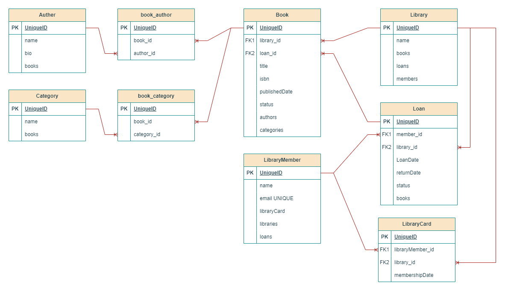

# Library Management System

## Overview

The **Library Management System** is a Spring Boot application designed to manage libraries, books, authors, categories, and members. It allows users to borrow and return books efficiently using a loan system. The project demonstrates the implementation of **Spring Boot JPA** with **PostgreSQL**, focusing on **entity relationships** and **CRUD operations**.

## Technologies Used

- **Spring Boot** - Backend framework
- **Spring Data JPA** - ORM for database operations
- **PostgreSQL** - Relational database
- **Spring Web** - RESTful API development
- **Lombok** - Reduces boilerplate code
- **Spring Boot DevTools** - Development utilities

## Features

- **Book Management** - Add, update, delete, and fetch books.
- **Author Management** - Manage multiple authors and their books.
- **Category Management** - Assign books to multiple categories.
- **Library System** - Manage libraries, their books, and members.
- **Library Card System** - Each member can have multiple library cards.
- **Loan System** - Borrow and return books with tracking.
- **Entity Relationships** - Well-structured database schema with relationships.

## Entity-Relationship Diagram (ERD)



## Database Schema & Relationships

1. **Author ↔ Book (Many-to-Many)**
   - An author can write multiple books.
   - A book can have multiple authors.

2. **Book ↔ Category (Many-to-Many)**
   - A book can belong to multiple categories.
   - A category can contain multiple books.

3. **Library ↔ Book (One-to-Many)**
   - A library holds multiple books.
   - A book belongs to only one library.

4. **Library ↔ LibraryCard ↔ LibraryMember (One-to-Many)**
   - A library has multiple **LibraryCards**.
   - A member can have multiple **LibraryCards**, but a **LibraryCard** belongs to only one member.

5. **Library ↔ Loan (One-to-Many)**
   - A library manages multiple **Loans**.

6. **Loan ↔ Member (One-to-Many)**
   - A member can have many loans.

7. **Loan ↔ Book (One-to-Many)**
   - A loan can contain multiple books.

## Setup Instructions

### Prerequisites

- Java 17 or later
- PostgreSQL installed & running
- Maven installed

### Installation Steps

1. Clone the repository:
   ```bash
   git clone https://github.com/your-repo/library-management.git
   cd library-management
   ```
2. Configure PostgreSQL in `application.properties`:
   ```properties
   spring.datasource.url=jdbc:postgresql://localhost:5432/library
   spring.datasource.username=your_username
   spring.datasource.password=your_password
   ```
3. Run the application:
   ```bash
   mvn spring-boot:run
   ```
4. Access the API at `http://localhost:8080/api/v1`

## API Endpoints

### Books
| Method | Endpoint      | Description       |
| ------ | ------------- | ----------------- |
| GET    | `/books`      | Get all books     |
| GET    | `/books/{id}` | Get book by ID    |
| POST   | `/books`      | Add a new book    |
| PUT    | `/{bookId}/assignt-to-author/{authorId}` | Assign book to author |
| PUT    | `/{bookId}/assignt-to-author/{categoryId}` | Assign book to category |
| PUT    | `/books/{id}` | Update a book     |
| DELETE | `/books/{id}` | Delete a book     |

### Authors
| Method | Endpoint      | Description       |
| ------ | ------------- | ----------------- |
| GET    | `/authors`    | Get all authors   |
| GET    | `/authors/{id}` | Get author by ID |
| POST   | `/authors`    | Add a new author  |
| PUT    | `/authors/{id}` | Update an author |
| DELETE | `/authors/{id}` | Delete an author |

### Categories
| Method | Endpoint      | Description       |
| ------ | ------------- | ----------------- |
| GET    | `/categories` | Get all categories |
| GET    | `/categories/{id}` | Get category by ID |
| POST   | `/categories` | Add a new category |
| PUT    | `/categories/{id}` | Update a category |
| DELETE | `/categories/{id}` | Delete a category |

### Libraries
| Method | Endpoint      | Description       |
| ------ | ------------- | ----------------- |
| GET    | `/libraries`  | Get all libraries |
| GET    | `/libraries/{id}` | Get library by ID |
| POST   | `/libraries`  | Add a new library |
| PUT    | `/libraries/{id}` | Update a library |
| DELETE | `/libraries/{id}` | Delete a library |

### Library Members
| Method | Endpoint      | Description       |
| ------ | ------------- | ----------------- |
| GET    | `/library-members`    | Get all members   |
| GET    | `/library-members/{id}` | Get member by ID |
| POST   | `/library-members`    | Add a new member  |
| PUT    | `/library-members/{id}` | Update a member |
| DELETE | `/library-members/{id}` | Delete a member |

### Library Card
| Method | Endpoint      | Description       |
| ------ | ------------- | ----------------- |
| GET    | `/library-cards`    | Get all cards   |
| GET    | `/library-cards/{id}` | Get card by ID |
| POST   | `/library-cards`    | Add a new card  |
| PUT    | `/library-cards/{id}` | Update a card |

### Loans
| Method | Endpoint      | Description       |
| ------ | ------------- | ----------------- |
| GET    | `/loans`      | View all loans    |
| GET    | `/loans/{id}` | Get loan by ID    |
| POST   | `/loans`      | Create a new loan |
| PUT    | `/loans/{id}` | Update a loan     |
| DELETE | `/loans/{id}` | Delete a loan     |

## Future Enhancements

- Add user authentication & authorization.
- Implement a fine system for overdue books.
- Enhance search & filtering options.

